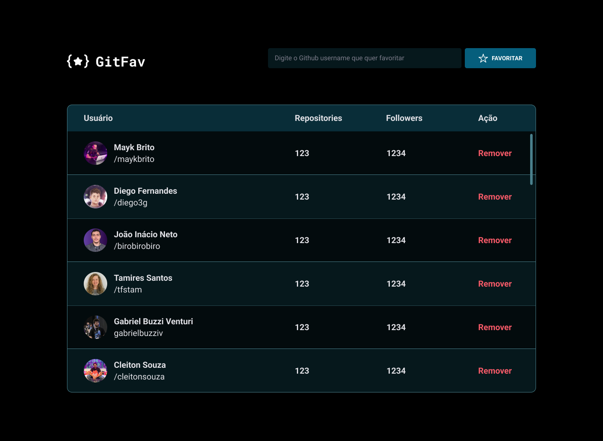

<h1 align="center"> Github Favorites 0.2</h1>

explorer 10 advanced challenge   
<a href="https://www.rocketseat.com.br/explorer">Meet the Explorer.</a>

  <a href="#-tecnologias">Technologies</a>&nbsp;&nbsp;&nbsp;|&nbsp;&nbsp;&nbsp;
  <a href="#-projeto">Project</a>&nbsp;&nbsp;&nbsp;|&nbsp;&nbsp;&nbsp;
  <a href="#-layout">Layout</a>&nbsp;&nbsp;&nbsp;|&nbsp;&nbsp;&nbsp;
  <a href="#memo-licença">License</a>

  

 

  

## 🚀 Technologies

This project was developed with the following technologies:

- HTML
- CSS
- JavaScript
- Git e Github
- Figma

## 💻 Project
 GitFav is an application developed in Rocketseat's explorer 10, we work with classes in JavaScript, the application retrieves user data from Github using the public API of Github and returns with the username, number of repositories and number of followers, thus saving the information in localStorage.

- [Access the finished project online](https://erlanmarinho.github.io/gitFav/)

##  License

This project is licensed under the MIT license.

---

Done with ♥ by Rocketseat :wave: [Join our community!](https://discord.gg/rocketseat)
